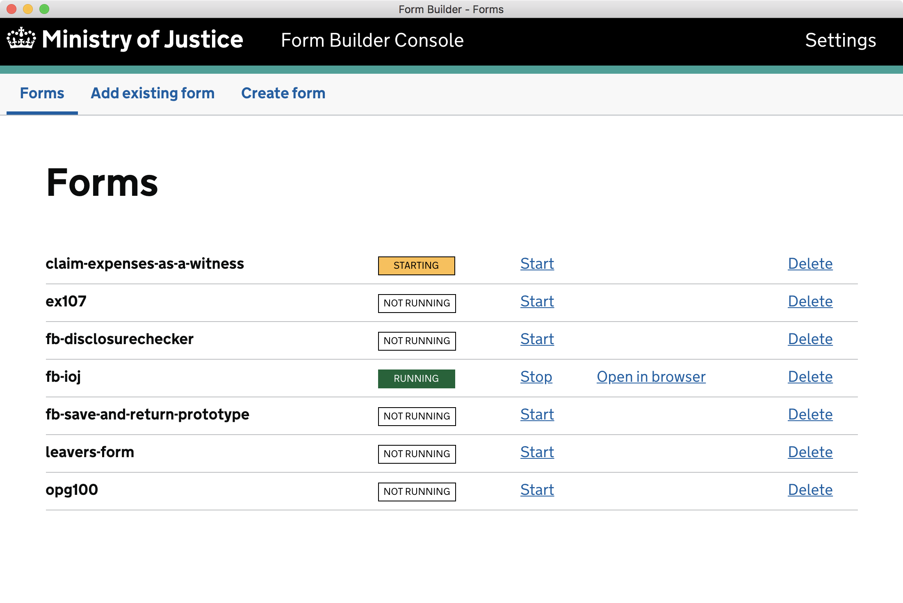

# fb-editor-console-electron

## Form Builder Console

**Form Builder Console** is an Electron app for users to run `Form Builder Editor` locally.

(It's currently built for Mac OS X only. [Let us know](mailto:form-builder-team@digital.justice.gov.uk) if you would use it for a different OS.)

## Installation

The preferred way to install is through the MoJ's `Self Service` application.

Alternatively:

- Download the latest release
- Double-click the zip file to expand the app
- Move the `Form Builder Console` app to the `Applications` directory

[Releases are available to download from GitHub.](https://github.com/ministryofjustice/fb-editor-console-electron/releases)

The app is signed by [Sequence Media Limited](https://github.com/sequencemedia) on behalf of the Ministry of Justice.

## Usage

Double-click the app's icon. The first time it is run the app will install the Editor and its dependencies.

## Creating forms and committing changes

Forms are created as Git repositories which are cloned to your file system. The repositories contain JSON files which are updated as you make changes to the form in Editor.

(In Mac OS you can find the repositories in `/Users/$USER/Documents/formbuilder/forms`.)

**Form Builder Console** does not currently provide a way to _commit_ or _push_ those changes - you must use your own Git client.

## License

[MIT](LICENSE)
