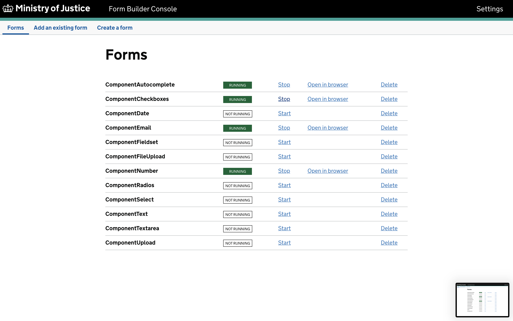
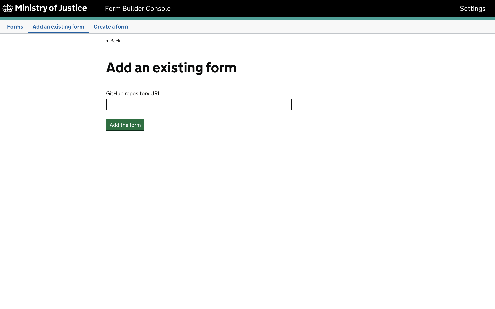
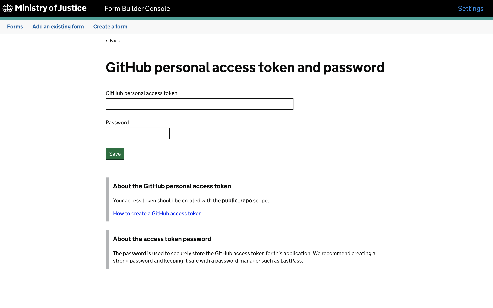

# fb-editor-console-electron

## Form Builder Editor Console

**Form Builder Editor Console** is an Electron app for users to run **[Form Builder Editor](https://github.com/ministryofjustice/fb-editor-node)** locally.

(It's currently built for macOS only. [Let us know](mailto:form-builder-team@digital.justice.gov.uk) if you would use it for a different OS.)

## Installation

The preferred way to install is through the MoJ's `Self Service` application.

Alternatively:

- Download [the latest release from GitHub](https://github.com/ministryofjustice/fb-editor-console-electron/releases)
- Double-click the zip file to expand the app
- Move the `Form Builder Console` app to the `Applications` directory

The app is signed by the Ministry of Justice.

## Usage

Double-click the app's icon. The first time it is run the app will install the Editor and its dependencies.

## Forms

Each Form is created as a Git repository on your file system. It contains JSON files which are updated as you make changes in **Editor**.

(In macOS you can find the repositories in `/Users/$USER/Documents/formbuilder/forms`.)

## GitHub

### Add an existing repository

You can clone a remote repository from GitHub.

### Create a form

You can create a repository on GitHub, too, but you will need to enter a _personal access token_. (Tokens are encrypted for safe-keeping, so you will also need to create a _password_.)

## Committing changes

**Form Builder Editor Console** does not currently provide a way to _commit_ or _push_ changes - you must use your own Git client.

## License

[MIT](LICENSE)
